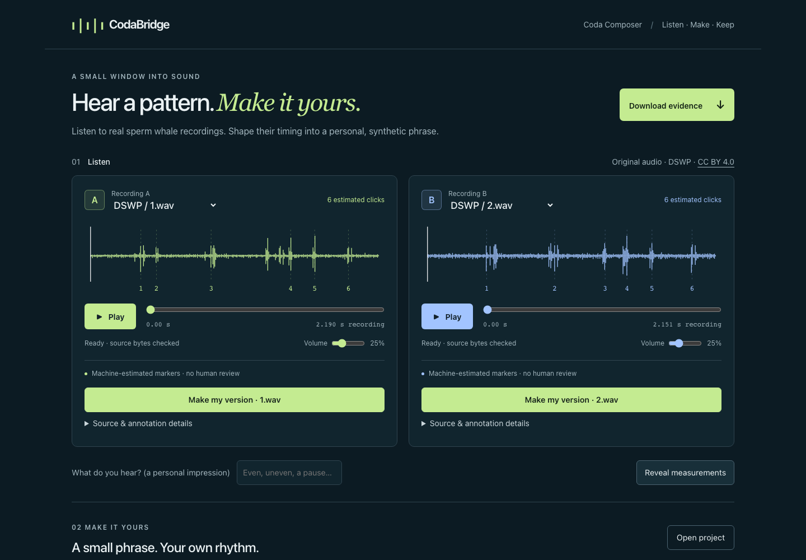
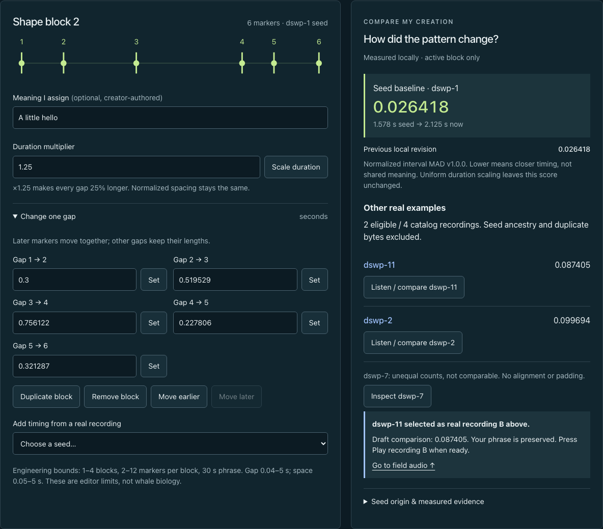
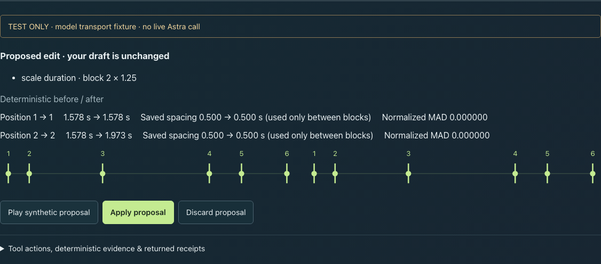

# MVP-03 local verification

This page preserves the original implementation's verification snapshot. See the subsequent [Composer quantitative-prose correction](MVP_03_NUMERIC_PROSE.md) for the current investigation policy and new regressions. Its constructed examples do not recover or reclassify the later failed live investigation; historical results and artifacts below remain unchanged.

Executed implementation: **`4c6b0bc76d9c803501312f0b23b38b008f68c89f`**. Foundation: `414bce9f6065776d2c4609c163460bfa344a216b` (Draft PR #3, stacked on Draft PR #2). The following evidence commit adds documentation/captures only. All original field data, historical trial reports, TEST ONLY screenshots and the existing PR stack remain unchanged.

## What works

The actual built application connects field listening and measurement reveal to a source-seeded synthetic phrase, independent block duplication/reordering/removal, duration and gap edits, between-block spacing, undo/redo, local source-aware comparison, a personal codebook, optional Astra proposal/investigation UI, and current-state WAV/card/project downloads. The default workspace remains unavailable for Astra; ordinary actions make no model requests.

Implementation files: `src/composer/model.ts` (typed creation, validation, operations, history/binding), `analysis.ts` (deterministic comparisons/retrieval), `sound.ts` (shared renderer/schedule, playback/WAV), `project.ts` (bounded persistence/import/card/files), `Composer.tsx` + `composer.css` (connected UI), and `server/composer.ts` (real server schemas, validation and tools). Small changes in `App.tsx`, `AudioCard.tsx`, `server/provider.ts` and `server/worker.ts` connect the existing foundations. No provider/model/deadline/output/tool limits, source files or measurements changed. [Contract and exact bounds](MVP_03.md).

## Commands and observed results

macOS arm64; Node 25.9.0; Playwright 1.63.0; Wrangler 4.131.1; Miniflare 5.20260911.0-alpha; workerd 1.20260911.1. No dependency or lockfile change. Prettier 3.6.2 was used as a temporary formatting tool, not added to the application.

| Actual command | Result |
| --- | --- |
| `env -u OPENAI_API_KEY npm run typecheck` | Passed. App, server, unit/artifact/browser test types. |
| `env -u OPENAI_API_KEY node --experimental-strip-types --test tests/composer.test.ts tests/composer-server.test.ts` | **40 passed**, zero failed/skipped. |
| `env -u OPENAI_API_KEY npm test` | **151 passed**, zero failed/skipped. Includes the original 111 regression tests. |
| `env -u OPENAI_API_KEY npm run data:verify` | Passed: all four original hashes, PCM metadata, pinned source-card hash and deterministic annotations reproduce. |
| `env -u OPENAI_API_KEY npm run lint` | Passed, no findings. |
| `env -u OPENAI_API_KEY npm run build` | Client and Worker ESM passed. Client JS 299.06 kB (92.40 kB gzip), CSS 23.32 kB; Worker 59.84 kB. No Sites operation. |
| `env -u OPENAI_API_KEY npm run test:server-build` | **13 passed**, zero failed/skipped. Includes new native workerd Composer execution. |
| `env -u OPENAI_API_KEY npm run test:browser` | **44 passed**, one worker, no retries. Desktop 1440×1000 and mobile 390×844 Chromium, plus 320 px / 200% text. |
| `git diff --check` and `git diff --cached --check` | Passed. |
| `ffprobe -v error -show_entries format=duration,size -show_entries stream=codec_name,width,height -of json docs/mvp03/evidence/TEST-ONLY-running-app.webm` | VP8, 1280×900, **16.48 s**, silent running-app capture. |

During development, initial exact-equality assertions exposed normal floating-point subtraction differences; tests use a tight arithmetic tolerance without rounding stored source data. Browser checks found a select-label lookup mismatch and enlarged-text score overflow; these were corrected. Legacy browser expectations now explicitly reveal measurements and use current introduction text. Legacy screenshots write to ignored test output instead of overwriting historical captures. Final runs above passed after corrections.

## Coverage and meaningful boundaries

- Source immutability, independent duplicate objects, duration-scale invariance, single-gap suffix semantics, spacing/order, unequal counts, seed/ancestral and byte-duplicate exclusion, candidate counts, no-op rejection, atomic invalid batches, revision-bound undo/redo, and 30-second/marker/block bounds.
- Natural-language edit request through the actual server/provider parser → typed operation proposal → deterministic preview → explicit Apply → Undo. Before/after facts include duration, spacing, order and added/removed blocks. Numeric arguments are validated typed data, not prose.
- Actual model-selected **fixture** `find_creation_alternatives` dispatch → tool evidence supplied back → accepted cited final explanation. Mixed assistant commentary and opaque reasoning are replayed internally and absent from exported explanation/evidence. No-tool finals, unknown tools/arguments, duplicate calls, finite rounds/deadlines, refusals, malformed operations, forged sources/references and numerical prose remain covered.
- Late responses after editing, undo, import, block selection and field selection are discarded. User controls/imports do not trigger inference. Invalid proposals leave the current draft intact.
- User-initiated synthetic playback, pause/resume/stop, rapid start/stop, editing cancellation and field/synthetic coordination. Unsupported audio and storage quota failures retain keyboard editing and file export. Malicious imported text stays inert; forged source URLs are rejected without fetching. Saved analysis is explicitly historical/unverified, bounded in bytes/depth/nodes and never revived as a proposal/live result.
- `tests/artifact/composer-workerd.test.ts` runs the built Worker with its **native fetch** inside the installed workerd runtime. An in-process outbound fixture prevents external requests. It verifies manual Request construction, tool dispatch/result replay/final validation, edit preview and non-followed 307 failure. Existing native constructor and 301/302/303/307/308 regression checks remain. This is stronger than a Node Request substitute, but still **TEST ONLY**, not live API compatibility.

## Running-app captures

These are actual product captures, not generated mockups. Desktop and mobile counterparts are in [the evidence directory](mvp03/evidence/). In-app Browser also opened the normal disabled preview and visibly confirmed the source-seeded editor, normalized comparison, controls, codebook and unavailable Astra state. Raw CDP was not needed or used. Desktop/native-app inventory was unavailable while locked; browser automation remained functional.

[Mobile listening](mvp03/evidence/mobile-chromium-listen.png) · [Mobile editor/comparison](mvp03/evidence/mobile-chromium-workbench.png) · [Complete local Composer](mvp03/evidence/desktop-chromium-local-composer.png).

**Model demonstration is TEST ONLY.** [16.48-second running-app capture](mvp03/evidence/TEST-ONLY-running-app.webm) shows field playback, a duplicated block, a proposal/preview, Apply/Undo/Redo, a single-gap edit, tool-backed real-catalog retrieval, selecting/listening to the returned field example, and the Coda Card. A persistent test-only banner labels the fixture recording. Deliberate capture pacing is confined to the browser test and does not alter provider deadlines. The screen capture has no audio track; the separate delivered WAV is the playable synthetic artifact.

[TEST ONLY retrieval screenshot](mvp03/evidence/desktop-chromium-TEST-ONLY-retrieval.png) · [Accepted TEST ONLY result/receipts/tool evidence](mvp03/evidence/TEST-ONLY-composer-result.json). The fixture makes one edit provider response and two investigation responses. These are mocked transport responses through actual validation/tools, not live Astra calls, latency observations or real token billing. Fixture prose is not a quality assessment of Astra.

## Delivered files, verified from browser downloads

The ordinary default-disabled browser journey genuinely downloaded all three files, then parsed/reopened the project. These files were copied from the browser's delivered download paths, not reconstructed substitutes:

- [Synthetic timing WAV](mvp03/evidence/creation-synthetic-timing.wav): PCM16 mono **48,000 Hz**, browser-decoded duration **4.293166666666667 s**, measured decoded peak **0.046357616782188416**, below renderer ceiling 0.16. Event placement matches the shared renderer in focused tests; browser decoding additionally checks actual delivery/readability. INFO metadata retains synthetic identity, creator labels/intention and source credit.
- [Coda Card PNG](mvp03/evidence/creation-card.png): actual Canvas output from the same revision, visually inspected for title, two-block pattern, creator meaning, durations, comparison, DSWP/CC BY credit and limitations. It explicitly identifies the companion audio/project. PNG signature and dimensions were checked after delivery.
- [Re-openable project JSON](mvp03/evidence/creation-project.json): revision **8**, title **Room to breathe**, two independent blocks, selected second block, creator label **A little hello**, source refs/original offsets, codebook, resolved credits and optional saved evidence. Parsed timing/block content matched the saved draft. Import restored the same content and active block under a new local revision, with saved analysis marked unverified; it did not play or call a model. Starting a new phrase and reloading retained the local codebook for reuse.

[Download observations](mvp03/evidence/download-verification.json) and [artifact manifest with implementation SHA and file checksums](mvp03/evidence/manifest.json). Both desktop and mobile Chromium journeys delivered/parsed files. This does not claim in-app Browser download delivery or Safari/Firefox/physical-device behavior.

## Status and remaining work

**Implemented:** complete local Composer journey and actual disabled-by-default server contract. **Mocked only:** new Astra model behavior, using explicit test transport fixtures. **Live-validated:** no new Composer model contract; prior MVP-02 successes remain historical evidence only. **Hosted:** untested and no Site created/saved/deployed.

No real key was read, copied or bound. All builds/tests excluded `OPENAI_API_KEY`; tests used an explicit inert sentinel. No paid model request, credential/account change, public enablement, merge or force-push occurred. Normal loopback preview status was rechecked as HTTP 200 / `unavailable` / `NOT_CONFIGURED`; checked-in operator flags remain false. Test-owned workerd instances and Playwright contexts close after use; the normal key-excluded preview is available for local review. No private trial bindings or harnesses were created.

Remaining concrete boundaries: a separately authorized small live Composer edit/tool investigation trial; actual human listening and annotation review; Safari/Firefox and physical-device/audio-output coverage; hosted Sites and download verification; and a separate public authentication/shared-budget decision. Local operator flags are neither authentication nor a shared spending cap. Four catalog examples and machine-estimated markers cannot establish whale semantics, general retrieval quality or biological validity. Context / Dialogue Lab remains the planned source-verified follow-on. PR stays Draft for review; parent launch issue #1 remains open.
