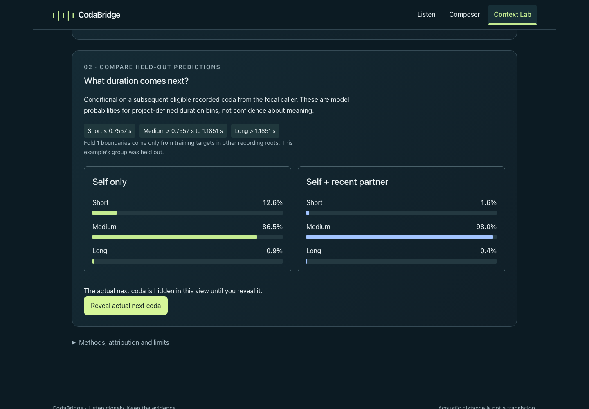
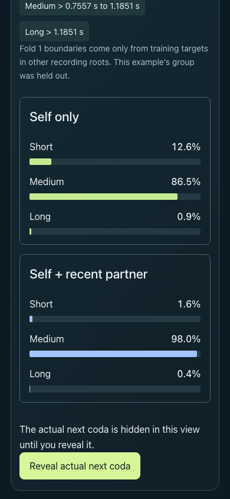
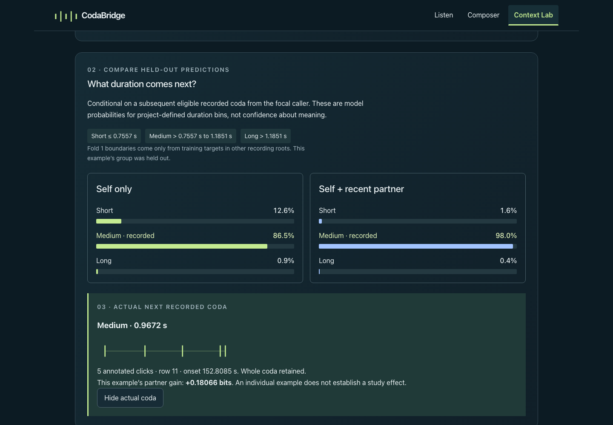
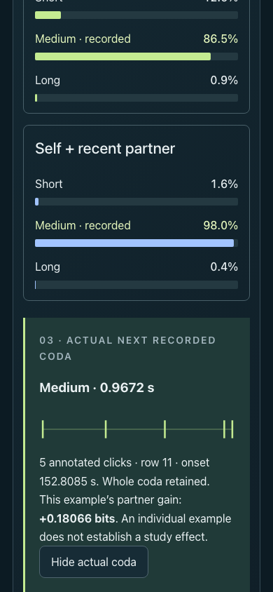

# MVP-05 · Dialogue Transfer v0.1

Implemented [owner assignment #10](https://github.com/hynk-studio/CodaBridge/issues/10): a reproducible offline predictive experiment and connected Context Lab Prediction mode. The experiment completed; the small pooled gain has an interval spanning zero. Implementation verification does not establish biological communication, causality, whale meaning or independent encounters.

Subsequent [PR #11 review correction and newly executed checks](dialogue-transfer-v0.1-review/README.md) make the headline uncertainty-aware and enforce the independent gradient tolerance. The original experiment and verification evidence below are retained unchanged.

Base: `0adb2c1585e1fbda9ea52b8bbd1745e498ec0341`. Protocol/cohort/split freeze: `5c07c77ec8f9b3a028737ec7a73b63181e44ee98`, committed before held-out scoring. Fitting producer: `44c4a09b83308a909d2086ab620b30621458d509`, tree `e946108b3949dbe74824f8d55263ccc2ffa8288c`. Verified application and first result-artifact commit: `ae59036e6c824d67711dbac110867f9695a728c6`, tree `1998f808b3e25917a9b94f77ae4d1cdc7e3ffc99`. The PR head also includes subsequent documentation/capture packaging; its exact final head is in PR metadata/description. Producer identity deliberately precedes the artifact commit.

## Actual fixed result

The full pinned CSV remains byte-identical: SHA-256 `1856c8bf915cc5ae6f928aaa2036cbbc6ad8840bb6e4f6a96aaeb96953215da2`. Attribution: Sharma et al. and the Dominica Sperm Whale Project, *Contextual and combinatorial structure in sperm whale vocalisations* (2024), Zenodo 10817697, archived release `7228c8eed2cc27ddd23b74c51aeccec9d762389e`, **CC BY 4.0**. [Source audit](CONTEXT_DATA.md), [complete source record](../data/context/source-record.json).

`parseAnnotations` validates all 3,840 raw rows, retaining 3,790 whole codas and 50 explicit exclusions. The prediction cohort contains **723 examples / 67 exact REC fragments / 19 six-character author recording roots**, drawn from 22 roots / 48 nine-character files / 219 REC in the full source. Two-local-caller and valid immediate-next rules give 1,392 opportunities before requiring four completed partner codas; the common lagged-history requirement removes 669. There are 38 long-coda targets and 97 examples with a long coda in their used history; none is clipped. No original WAV is associated with an annotation row.

All related nine-character source files/fragments stay together under the broader six-character root used by retained notebook traversal and associated PRH sensor-file grouping. Histories remain inside exact REC; global caller identities and confirmed encounters are not inferred. Group sizes are uneven, **2–168** evaluated codas. The two-caller temporal audit has 17 rejected/ambiguous barriers, no >60-second onset gaps, and no repeated valid events or overlapping intervals across distinct fragments of the same nine-character file. [Detailed audit](../analysis/dialogue-transfer/eligibility-audit.json), [group allocations and predetermined example IDs](../analysis/dialogue-transfer/split-manifest.json), [pre-score source-semantics clarification](../analysis/dialogue-transfer/README.md).

All models use identical train/test cases, fold-specific training-target quantiles, train-only median imputation/scaling, and fixed L2 multinomial logistic fitting (`C=1`, intercept, `lbfgs`, tolerance `1e-6`, 2,000 iteration limit, no class weights/search). M2-lagged is separately fitted on third/fourth latest completed partner codas with original ages; no circular wrap or future donor. There were **no failed folds, collapsed classes, nonconvergence or clipped probabilities**.

| Model | Mean held-out log loss, bits/coda |
| --- | ---: |
| M0 · training frequencies | 1.58505117 |
| M1 · current/previous focal | 0.63376433 |
| M2 · self + recent partner | 0.63156177 |
| M2-lagged · self + older partner | 0.65172189 |

| Paired contrast | Pooled gain, bits/coda | 95% paired group-bootstrap interval |
| --- | ---: | --- |
| M2 vs M1 · primary | +0.00220256 | [−0.05468204, +0.06934151] |
| M2-lagged vs M1 | −0.01795756 | [−0.05677792, +0.02408623] |
| M2 vs M2-lagged | +0.02016012 | [−0.03423974, +0.09548250] |

Group-macro primary gain is **+0.05647774** (secondary), interval **[+0.01111565, +0.10593356]**; this does not replace the nearly zero pooled estimate. Bootstrap: 2,000 fixed-seed (`20260913`, PCG64) uniform parent-root resamples with replacement, keeping all paired rows and multiplicities; pooled weighting divides summed gain by summed row counts. Percentile intervals are conditional/descriptive for the fitted OOF records, omit model-refit uncertainty, and cannot certify encounter/animal independence. The older control is not an exchangeable null; recency, shared setting, tempo drift, type and selection remain confounds. The archive/paper 3,840/3,948 correspondence remains unresolved.

| Held-out fold | Training / held-out cases | Training-only duration edges, seconds |
| --- | --- | --- |
| 1 | 461 / 262 | 0.7556909667 / 1.1851083000 |
| 2 | 622 / 101 | 0.8768083000 / 1.1902011000 |
| 3 | 614 / 109 | 0.9109972333 / 1.2015581333 |
| 4 | 563 / 160 | 0.7598500333 / 1.1689426333 |
| 5 | 632 / 91 | 0.8445494333 / 1.1689426333 |

Exact edges and the convention `short <= low`, `medium > low and <= high`, `long > high` are in each OOF record. Scoring uniformly floors class probabilities at `1e-12` and renormalizes; raw and scoring probabilities are both retained. See [full report](../analysis/dialogue-transfer/results/report.json) and [offline fitted preprocessing/coefficients](../analysis/dialogue-transfer/results/fold-fits.json).

The pinned NumPy/macOS backend produced `matmul` RuntimeWarnings despite finite converged results. A [separate TEST ONLY finite-matrix diagnostic](../analysis/dialogue-transfer/results/backend-diagnostic.json) reproduces them and matches a non-BLAS contraction exactly, consistent with [NumPy’s upstream report](https://github.com/numpy/numpy/issues/28687). The independent TypeScript verifier reconstructs all saved probabilities using scalar dot products/softmax (maximum difference **9.9920e-16**) and training gradients (maximum component **9.9750e-7**, below the frozen tolerance). The unchanged fit reproduces. No dependencies, solver, thresholds, features, folds or seeds were changed after scoring; no results were replaced or tuned.

## Connected experience and evidence

Context Lab → **Dialogue Transfer / Prediction** → inspect completed history → compare held-out self/self+partner probabilities and fold-specific bins → **Reveal actual next coda** → inspect older context and the whole study → download the sourced JSON. Five examples are fixed by first eligible source order from the first five eligible recording roots. The first example lacks previous focal history and explicitly shows that missing-history state.

Before Reveal, the target is absent from rendered markers, text, accessibility output and audio scheduling. Example changes and leaving the workspace reset Reveal. Static data contain targets; this is a pedagogical reveal, not secrecy. No prediction packet enters an Astra/tool request, and no new provider contract or inference endpoint exists. Prediction adds no audition; existing playback is stopped on navigation. Listen, Composer drafts/codebook, Undo/Redo, exclusive playback, descriptive Lab and existing project import/export remain covered by tests.

Visually inspected actual running-app captures:

| Desktop | Phone |
| --- | --- |
|  |  |
|  |  |

[Desktop study](dialogue-transfer-v0.1/desktop-study.png) · [phone study](dialogue-transfer-v0.1/phone-study.png) · [320 px / 200% text](dialogue-transfer-v0.1/phone-320-enlarged.png) · [pre-Reveal accessibility snapshot](dialogue-transfer-v0.1/before-reveal-accessibility.txt).

**Actual browser-delivered JSON:** [downloaded report](dialogue-transfer-v0.1/browser-delivered.json), **2,128,588 bytes**, SHA-256 `0c9f61cb547fec66a57e302a393623066ff6d5fbf0e7d1975fc2c30734c5029d`. Both desktop and phone downloads matched this hash and byte count. The separate validated browser summary is 48,798 bytes; the UI does not load training matrices or coefficient tables. [Desktop evidence](dialogue-transfer-v0.1/desktop-evidence.json), [phone evidence](dialogue-transfer-v0.1/phone-evidence.json), [capture/file manifest](dialogue-transfer-v0.1/manifest.json).

## Commands actually run

Environment: macOS arm64, Node **25.9.0**, npm **11.12.1**, Python **3.12.14** in a repository-local venv, NumPy **2.2.6**, SciPy **1.15.3**, scikit-learn **1.7.2**, joblib **1.5.2**, threadpoolctl **3.6.0**, Playwright **1.63.0**. No system environment/package changes. See [exact setup and reproduction instructions](../analysis/dialogue-transfer/README.md).

| Command (from repository root) | Observed result |
| --- | --- |
| `env -u OPENAI_API_KEY node --experimental-strip-types scripts/prepare-prediction.ts` | Full data-only audit and freeze artifacts generated before scoring |
| `env -u OPENAI_API_KEY node --experimental-strip-types --test tests/prediction-cohort.test.ts` | 6/6 passed after correcting a test that confused parser-rejected exact duplicates with valid repeated-event audit entries |
| `env -u OPENAI_API_KEY analysis/dialogue-transfer/.venv/bin/python -m unittest discover -s analysis/dialogue-transfer -p 'test_*.py' -v` | 6/6 isolated analysis tests passed |
| `env -u OPENAI_API_KEY analysis/dialogue-transfer/.venv/bin/python analysis/dialogue-transfer/run.py` | Actual fixed real-source experiment completed, all five folds |
| `env -u OPENAI_API_KEY npm run analysis:verify` | Independent source/producer/cohort/split/preprocessing/probability/metric/bootstrap/schema verification passed |
| `env -u OPENAI_API_KEY npm run analysis:reproduce` | Unchanged experiment reproduced within declared tolerances; saved files untouched |
| `env -u OPENAI_API_KEY npm run typecheck` | Passed; initial Notice prop mismatch corrected before browser testing |
| `env -u OPENAI_API_KEY npm test` | 184/184 application tests passed |
| `env -u OPENAI_API_KEY npm run data:verify` | Four original WAVs/source card and unchanged Context derivation verified |
| `env -u OPENAI_API_KEY npm run lint` | Passed |
| `env -u OPENAI_API_KEY npm run build` | Production client + native Worker build passed; final CSS included |
| `env -u OPENAI_API_KEY npm run test:server-build` | 15/15 native Worker/artifact tests passed, including default-disabled model endpoints |
| `env -u OPENAI_API_KEY npm run test:browser` | 90/92 passed: all 84 pre-existing cases and six new cases; two new enlarged-text cases exposed a 7 px grid overflow |
| `env -u OPENAI_API_KEY npm run test:browser -- tests/browser/prediction.spec.ts` | **8/8 passed after the scoped grid fix**, including desktop/phone, 320 px/200%, failure/null/negative/zero states and report failures; unchanged pre-existing suite not repeated |

The first focused browser run also used an invalid empty A/B request and received its expected validation rejection (400); the endpoint check was corrected to send valid source-bound input. Final valid default POSTs to `/api/investigate`, `/api/composer` and `/api/lab` all returned **503 / NOT_CONFIGURED**. Prediction page navigation sent no model POSTs and produced no browser errors. Automated fixtures elsewhere remain TEST ONLY; no paid provider request was made.

The tests cover validation/hash parity, whole long codas, invalid/unknown/duplicate/overlap/gap barriers, local caller isolation, grouped splits, train-only preprocessing/edges, cutoff/precision/target overlap, no future/cyclic donors, shared cohorts, separately trained control, independent metric fixtures, clipping/sign/log base, bootstrap pairing/weights, degenerate/failing fits, reproducibility/provenance, future-content mutations versus available-history mutations, and truthful unavailable/null/negative UI. TEST ONLY known-coupling and independent-process diagnostics are separate; the independent finite sample has a small positive gain and is not required to equal zero.

Additional in-app Browser inspection used tab-level CDP `Runtime` and `Network`, accessibility state and screenshots at the local preview. It observed Reveal’s target appearing only after the explicit action and used DOM measurements to locate the enlarged-text grid overflow. Temporary viewport/font overrides were restored. The expiring keep-awake lease and local preview are cleaned up after review packaging.

## Evidence limits

No merge, force-push, deployment, Site creation/save, public inference, credential inspection, paid application-model call, account/billing change, service provisioning, WhAM or GPU training. `.openai/hosting.json` remains the genuine empty placeholder. Local client/Worker compatibility is verified; hosted Sites behavior is untested. No new recordings/annotations were acquired. Human listening, physical-phone observation, broad scientific validation and independent encounter identities remain unverified. Historical trial evidence and the unrelated pre-existing untracked PNG are preserved.
