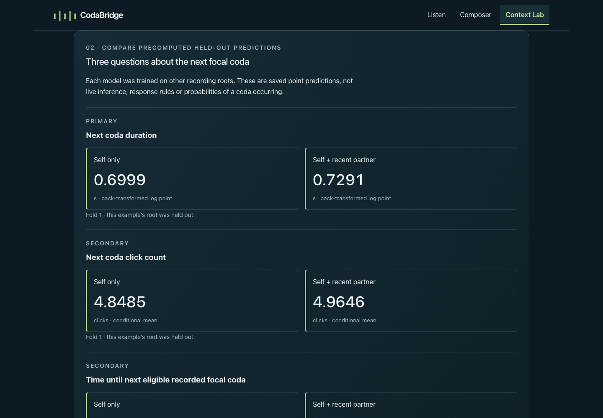
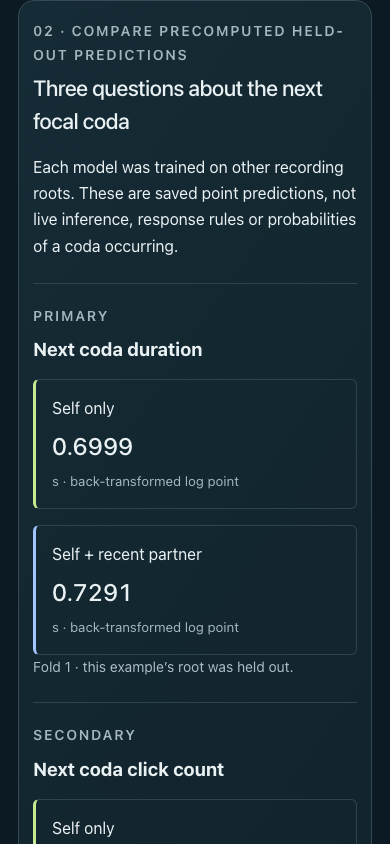
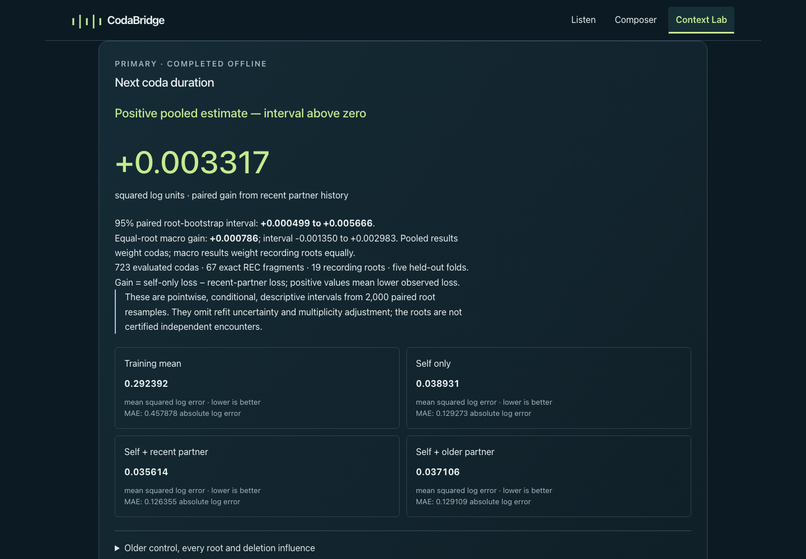
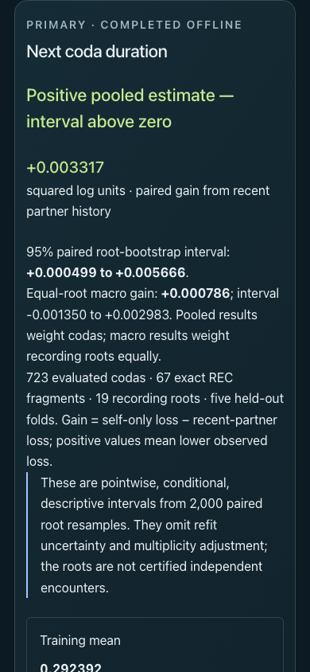

# MVP-05B · Dialogue Transfer v0.2

[Owner assignment #12](https://github.com/hynk-studio/CodaBridge/issues/12) is implemented, executed and verified. **All three core endpoints and the one coverage sensitivity completed: 55 learned fits, no failed endpoint.** The primary pooled duration gain has an interval above zero; count gain is negative, and gap/coverage pooled intervals span zero. This is exploratory reuse of the v0.1 data, not independent confirmation or validated whale-response rules.

## Identities and preservation

Rechecked main was `dffc940dc380151c9b0520e1cd7cfd76c8b2a92d`, already containing merged #11 and both review corrections at `f8f2b43222d006fc4d067a3776a6e459b81c41df`. The uncertainty-aware v0.1 headline and enforced finite/≤1e-6 gradient check remain intact. No correction task was duplicated. The new branch is `codex/mvp-05b-dialogue-transfer-v02`, based on main; no merge or simulated approval was performed for this task.

| Identity | Commit |
| --- | --- |
| Base main | `dffc940dc380151c9b0520e1cd7cfd76c8b2a92d` |
| Pre-score executable protocol/cohorts/splits/numerical freeze | `ab422e5e9df914a924f7df65229fefd1cb1711f3` |
| Actual fitting producer | `f9e70e2e82d899bfa9e914983aa4de6e8cf9f702` |
| First saved result artifacts | `83ffd5983da544029fcdbd70d2f5cf77430a8307` |
| Verified application implementation | `53d32f9ad31fd8d4c8c30e8cba341cb2cf97d10a` |

Producer tree: `39ad0274d2850d7499df869ba926d8b381d44a8f`. Later commits package review documentation/evidence; the exact final head/base are recorded in the new Draft PR. [Preservation check](dialogue-transfer-v0.2/preservation.json): **135 v0.1 source/analysis/public/historical-evidence files** match the base manifest byte-for-byte. V0.2 results also still match their first artifact commit. No old protocol, cohort, split, fitted coefficient, result, bootstrap draw, provenance, public artifact or historical download was edited. The unrelated pre-existing PNG remains untracked and untouched.

## Source and eligibility

The unchanged full annotation CSV is **500,380 bytes**, SHA-256 `1856c8bf915cc5ae6f928aaa2036cbbc6ad8840bb6e4f6a96aaeb96953215da2`, archived release `7228c8eed2cc27ddd23b74c51aeccec9d762389e`, [Zenodo 10817697](https://zenodo.org/records/10817697), **CC BY 4.0**; credit Sharma et al. and the Dominica Sperm Whale Project. `parseAnnotations` retains 3,790 validated whole codas from 3,840 rows, with 50 explicit source exclusions. No new raw validator, notebook execution, unpickling, field-WAV join or global caller identity was introduced.

The bounded desk audit checked the pinned archive/tree/README, retained notebook text, the broader CSV header, author plot book, [paper](https://www.nature.com/articles/s41467-024-47221-8), supplementary discussion and source-linked current data listing. No explicit dialogue REC-to-session/individual crosswalk or justified cross-root coalescing was found. The broader CSV has Date/Unit/IDN but no dialogue REC/file join key; similar timings or names were not used to invent one. PRH references exist in notebook text, but those files are absent from the pinned tree. The archive/paper 3,840/3,948 discrepancy remains unresolved. [Pre-score source audit and exact limitations](../analysis/dialogue-transfer-v02/METHODS.md), [metadata identities](../analysis/dialogue-transfer-v02/source-audit.json).

The paper's simultaneous/overlapping duration comparison and this completed-history next-focal forecast have different estimands. Neither a null nor positive forecast replicates or refutes that overlap analysis. Count is not the paper's ornamentation construct.

| Cohort | Codas | Exact REC | Parent roots | Long targets, >12 clicks |
| --- | ---: | ---: | ---: | ---: |
| Core: four completed partners | 723 | 67 | 19 | 38 |
| Coverage: two completed partners | 1,017 | 89 | 20 | 43 |

All three core targets exist on **every original core ID**, with exact v0.1 features and five folds. Duration is ICI-sum whole-coda duration; count is validated whole click count; gap is immediate-next focal onset minus current completion, strictly positive after precision checks. Core ranges are 0.254256–1.8621824 seconds, 3–25 clicks, and 0.6784567–54.0503641 seconds. Rejected next focal codas remain barriers; no later valid call is substituted. Histories remain within exact REC, with strict completed-call cutoffs and original timing precision.

Coverage adds 294 otherwise eligible examples. It still excludes 375 of 1,392 pre-history opportunities, while core excludes 669. The only new root, `sw119b`, is appended at index 19 and assigned fold 4 (zero-based); old root folds remain unchanged. Coverage uses only M0/M1/M2, never invented older donors. Every comparison uses common support within its own endpoint/cohort.

## Actual outcomes

Fixed train-only median imputation and standardization precede Ridge (`alpha=1`, SVD) for log-duration/gap and Poisson regression (`alpha=1`, L-BFGS, `tol=1e-6`, `max_iter=2000`) for count. M2-lagged is a fresh fit with third/fourth latest completed partner codas and their original ages. M0 is the appropriate training mean. No target-dependent predictor, tuning, extra interaction, seed/lag search or outcome-selected group/target was added. [Frozen protocol](../analysis/dialogue-transfer-v02/protocol.json).

| Prespecified analysis | Recent vs self pooled gain | 95% paired root interval | Equal-root macro gain | 95% macro interval |
| --- | ---: | --- | ---: | --- |
| **PRIMARY log-duration** · squared log units | **+0.00331711** | **[+0.00049893, +0.00566578]** | +0.00078608 | [−0.00134976, +0.00298342] |
| SECONDARY count · Poisson deviance/coda | −0.00955325 | [−0.02351281, +0.00290169] | −0.01527236 | [−0.02538069, −0.00540276] |
| SECONDARY log-gap · squared log units | +0.00127290 | [−0.00468375, +0.00663325] | +0.00872358 | [−0.00289729, +0.02575263] |
| COVERAGE log-duration · squared log units | +0.00251731 | [−0.00100117, +0.00481117] | +0.00043368 | [−0.00361957, +0.00331434] |

Gain is paired loss(self-only) minus loss(recent-partner). These are natural-log squared errors or Poisson deviances, **not bits**; they cannot be subtracted from v0.1 classification loss. Both target and estimator changed, so this does not isolate binning as the cause of any difference.

| Mean held-out loss | M0 | M1 self | M2 recent | M2-lagged |
| --- | ---: | ---: | ---: | ---: |
| Core log-duration | 0.29239155 | 0.03893078 | 0.03561367 | 0.03710603 |
| Count | 1.39056474 | 0.61131938 | 0.62087264 | 0.62837787 |
| Log-gap | 0.22693239 | 0.23851148 | 0.23723858 | 0.24301924 |
| Coverage log-duration | 0.31289873 | 0.03695331 | 0.03443601 | Not fitted by design |

Core older-vs-self / recent-vs-older pooled gains are respectively **+0.00182474 / +0.00149237** for duration, **−0.01705849 / +0.00750524** for count, and **−0.00450775 / +0.00578066** for gap. All six corresponding pooled intervals span zero. The older comparison changes recency and does not remove shared context, tempo, type or eligibility confounds. The gap M0 loss is lower than every fitted model's loss.

[Complete tables](../analysis/dialogue-transfer-v02/RESULTS.md) retain every model's pooled/macro loss and MAE, every contrast/interval, all root contributions/deletions, all six cells in each endpoint's three fixed partitions, and every fold threshold. The [full report](../analysis/dialogue-transfer-v02/results/report.json) contains every sourced prediction/error and all bootstrap mappings. Core roots contribute 2–168 examples; coverage roots 2–201. Duration has 13 positive and six negative root gains. Removing any single root's **fixed predictions** leaves its pooled point gain positive, ranging +0.00162198 to +0.00355326; this is not refitted leave-one-group-out validation. Gap deletion point estimates cross zero. The 11 core examples without previous focal history are sparse even though they span nine roots; no stratum was selected to replace a whole-study result.

Uncertainty uses 2,000 uniform paired parent-root draws with replacement, seed `20260913`, PCG64 and linear percentiles. Every sampled root retains its rows and multiplicity; the three core endpoints share draw indices. Intervals are **pointwise, conditional and descriptive**. They omit model-refit uncertainty and multiplicity adjustment and do not establish encounter/animal independence. Macro weighting is secondary and does not replace the primary pooled result. Coverage changes selection and training support together; it is not an independent replication or permission to choose a better-looking cohort.

## Numerical verification and warning evidence

All 55 fits passed enforced finite/normal-equation or gradient checks. The independent scalar verifier observed maximum Ridge residual/bound ratio **0.002226746**, maximum Poisson gradient **8.6312813e-7 ≤1e-6**, and prediction replay difference **2.1316282e-14**. Poisson took 27–41 iterations. Its independent objective/scaling fixture matches the pinned implementation, accounting for the omitted target-only half-deviance constant. Ridge's dimension-scaled backward-error bound was justified and frozen before scoring. [Numerical details and exact reproduction commands](../analysis/dialogue-transfer-v02/README.md).

One M1 and one M2 count prediction exceeded their respective training count range; none exceeded the source-valid range 2–29. No fitted mean was rounded or clipped for scoring. UI values are display precision, and exponentiated log predictions are back-transformed points rather than arithmetic expected values.

The run retained **4,014 `matmul` RuntimeWarnings** (duration 120, count 3,699, gap 120, coverage 75), despite finite verified results. Their messages/file/line/fold/model remain in the report; unchanged numerical reproduction passed. The original v0.1 warning and TEST ONLY backend diagnostic are preserved, not reinterpreted as a fit failure. No dependency, tolerance or solver was changed to suppress a warning or obtain a favorable result.

## Connected experience and actual delivery

Context Lab → Dialogue Transfer / Prediction → **Follow-up research · v0.2** → completed history → held-out self/recent points for all three core endpoints → **Reveal v0.2 actual next coda** → older controls, every aggregate and sourced download. Five examples follow the frozen source-order rule. Example/version/workspace changes reset Reveal. Target marks, duration/count/onset/gap, target-derived errors and accessibility text are absent before Reveal; no new audio audition or model path exists. Static targets are public data, so Reveal is pedagogical, not secrecy.

Visually inspected captures of the running production build:

| Desktop | Phone |
| --- | --- |
|  |  |
|  |  |

[Revealed target](dialogue-transfer-v0.2/desktop-revealed.png) · [phone Reveal](dialogue-transfer-v0.2/phone-revealed.png) · [count](dialogue-transfer-v0.2/desktop-study-count.png) · [phone gap](dialogue-transfer-v0.2/phone-study-gap.png) · [phone coverage](dialogue-transfer-v0.2/phone-study-coverage-duration.png) · [320 px / 200% text](dialogue-transfer-v0.2/phone-320-study.png) · [enlarged download button](dialogue-transfer-v0.2/phone-320-download.png).

**Actual browser-delivered JSON:** [v0.2 report](dialogue-transfer-v0.2/browser-delivered.json), **10,986,207 bytes**, SHA-256 `1277fdd2ed8ea940568cfd6afe6ae4d03f16629be3e945514b189125fdd68e24`. Desktop and phone deliveries match the checked-in report exactly. Browser summary: **163,666 bytes**, bounded at 262,144; report bounded at 33,554,432. Coefficient tables and training matrices remain offline. [Desktop evidence](dialogue-transfer-v0.2/desktop-browser-evidence.json), [phone evidence](dialogue-transfer-v0.2/phone-browser-evidence.json), [pre-Reveal accessibility](dialogue-transfer-v0.2/desktop-before-reveal-accessibility.txt), [file manifest](dialogue-transfer-v0.2/manifest.json).

The in-app Browser also used tab-level CDP Runtime/Network: summary GET 200, no target node before Reveal, the sourced row-11 target after explicit Reveal, final endpoint wording present, 1,280 px document/viewport width without overflow, and no console errors. The owned preview tab, local preview process and 30-minute keep-awake lease were stopped after inspection. A reused-preview watcher logged one temporary `Could not resolve dist/server/index.js` error in this rebuild session; the completed production build and subsequent full/final browser journeys passed against the served Worker. No persistent runtime failure was observed.

## Newly executed checks

Environment: macOS 26.6.2 arm64, Node 25.9.0, npm 11.12.1, Python 3.12.14 and the pinned numerical packages above; Playwright 1.63.0. The commands below were executed for this v0.2 task. Older test counts, recordings of live trials and v0.1 historical downloads remain historical evidence, unchanged.

| Command, repository root | Observed outcome |
| --- | --- |
| `env -u OPENAI_API_KEY npm run analysis:v02:prepare` (initially direct equivalent script command) | Data-only exact parity and both manifests generated before scoring |
| `env -u OPENAI_API_KEY npm run analysis:v02:test` | 7/7 isolated TEST ONLY diagnostic groups passed |
| `env -u OPENAI_API_KEY node --experimental-strip-types --test tests/research-analysis.test.ts` | 4/4 upstream/cohort/numerical/metric tests passed |
| `env -u OPENAI_API_KEY node --experimental-strip-types --test tests/research-prediction.test.ts` | 4/4 schema/projection/failure/byte-bound tests passed |
| `env -u OPENAI_API_KEY npm run analysis:v02:run` | Actual fixed package: all 55 fits and four analyses completed |
| `env -u OPENAI_API_KEY npm run analysis:v02:verify` | Independent replay, stationarity, metrics/bootstrap, source/freeze/producer/protection and browser schema passed |
| `env -u OPENAI_API_KEY npm run analysis:v02:reproduce` | Unchanged numerical reproduction passed; no output overwritten |
| `env -u OPENAI_API_KEY npm run analysis:verify` | Original v0.1 verifier passed; max gradient 9.9749997e-7, below its unchanged bound |
| `env -u OPENAI_API_KEY npm run typecheck` | Passed |
| `env -u OPENAI_API_KEY npm test` | 199/199 passed |
| `env -u OPENAI_API_KEY npm run data:verify` | Original field/source bytes and Context derivation passed |
| `env -u OPENAI_API_KEY npm run lint` | Passed |
| `env -u OPENAI_API_KEY npm run build` | Production client and native Worker compatibility build passed |
| `env -u OPENAI_API_KEY npm run test:browser -- tests/browser/prediction.spec.ts tests/browser/research-prediction.spec.ts` | 14/14 desktop/phone checks passed for both versions |
| `env -u OPENAI_API_KEY npm run test:browser -- tests/browser/research-prediction.spec.ts` | 6/6 passed after clarifying the gap title to explicitly include “eligible”; final captures rebuilt |

[Raw isolated-test output](dialogue-transfer-v0.2/isolated-tests.txt), [actual experiment output](dialogue-transfer-v0.2/experiment.txt), [independent verification](dialogue-transfer-v0.2/independent-verification.txt), [reproduction](dialogue-transfer-v0.2/reproduction.txt), [application tests](dialogue-transfer-v0.2/application-tests.txt), [both-version browser checks](dialogue-transfer-v0.2/browser-tests.txt), [final v0.2 browser checks](dialogue-transfer-v0.2/browser-v02-final.txt).

Browser checks exercised actual JSON delivery, absent pre-Reveal targets/aria/audio, reset on example/version/workspace, desktop/phone/320 px and 200% text without page overflow, horizontally scrollable root tables, all result signs/units, TEST ONLY loading/failed/insufficient/download errors, original Prediction, descriptive playback ownership, and return-to-Composer with draft/codebook/Undo/Redo preserved. Valid default requests to `/api/investigate`, `/api/composer`, `/api/lab` returned **503 / NOT_CONFIGURED**; UI navigation sent zero model POSTs. Existing import/export owners were unchanged and their unit tests passed. Unchanged v0.1 refitting, full unrelated browser suites and native-Worker test suites were not mechanically repeated; original `analysis:verify`, the production build and affected Worker-served browser checks were run.

## Decision note

This fixed package supports a modest **observed pooled duration forecasting gain** from recent completed partner history on the selected recorded cases. It leaves the equal-root and recent-versus-older distinction uncertain. Self-history predicts duration and count much better than their training-mean baselines here; adding partner history worsens the fixed count result. The conditional-gap result remains uncertain and its learned models do not beat M0. These statements concern these targets, features and regularized models; they are neither general claims about communication nor evidence of no effect.

Unequal recording-root sizes matter: pooled and macro answers differ, and root identities do not establish independent encounters. Four-partner eligibility selects a restricted portion of the observed record; two-partner sensitivity changes both training and evaluation support and has a pooled interval spanning zero. Sparse history strata and reused animals/settings may limit inference beyond these selected cases. A pre-score freeze protects this execution from later outcome selection, but cannot turn reused data into independent confirmation.

The most useful missing data are an explicit row/REC/file-to-recording-session-and-individual crosswalk, documented shared-session/multiple-tag duplication and time origins, the archive/paper row correspondence, and independent annotated encounters with sufficiently complete recording boundaries and past history. Such metadata would permit defensible encounter grouping; independently held-out recordings would address generalization; recording/censoring information is necessary before broader event-time claims. These are identified data needs, not an initiated acquisition campaign.

Human-authored styling may use observed durations, click spacing/counts, repetition and timing variation as **descriptive inspiration**, while retaining source provenance and the human's own interpretation. This package does not supply validated whale-response rules, whale semantics, causal turn-taking, ornament detection or a generative distribution for arbitrary synthetic codas. Better forecasting on recorded examples alone does not validate such generation. Stop here for research review before Packet, Exchange or encryption work.

No merge, force-push, deployment/Sites creation, live inference enablement, credential inspection, paid model request, account/billing change, provisioning, new recordings, animal playback or GPU/neural training occurred. Hosted operation, independent biological validation and human listening were not newly tested.
