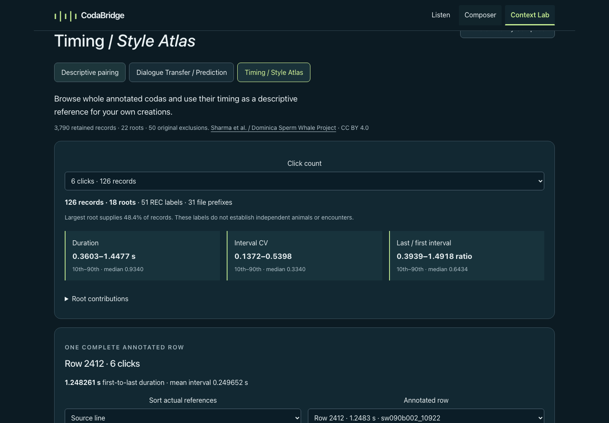
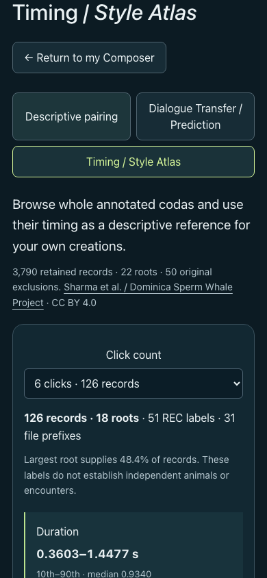
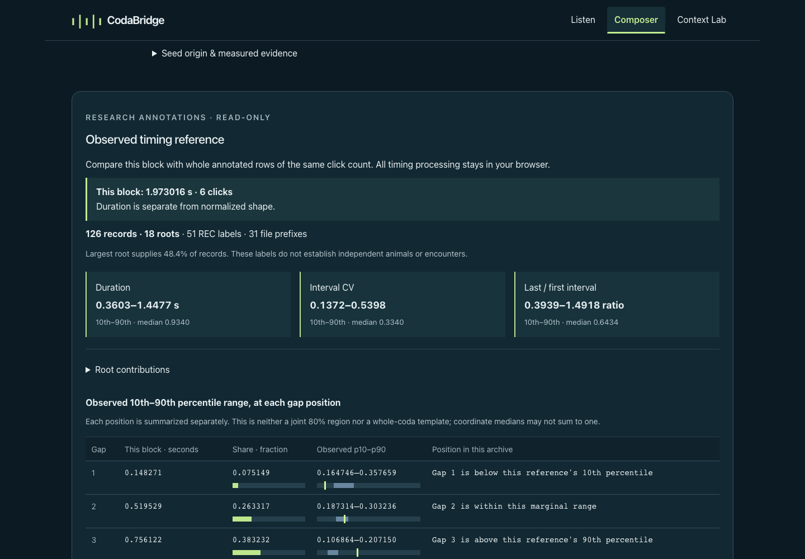
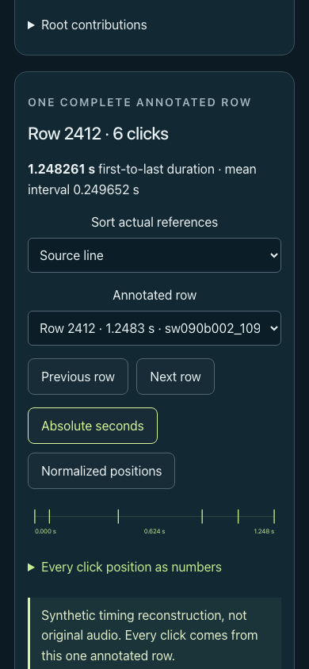

# MVP-06 · Observed Timing / Style Atlas

Implemented [owner assignment #15](https://github.com/hynk-studio/CodaBridge/issues/15): full-source descriptive derivation → actual annotated-row inspection/audition → read-only selected Composer block comparison → sourced downloads. This is a local product/research slice, with no new fitting, provider contract, field-audio join, Atlas import into Composer or deployment.

## Source and executed coverage

Base main: `d50c3a7050f40823e56fd050f2a4e64277d8c96f`, including merged #13/#14. Work branch: `codex/mvp-06-style-atlas`; implementation/artifact commit is `ffa04a08fce988b0843813acae1e722cb0f9ea6c`; final head is recorded in the Draft PR. The pre-existing untracked PNG was untouched.

The unchanged **500,380-byte** `data/context/sperm-whale-dialogues.csv` comes from [Zenodo 10817697](https://zenodo.org/records/10817697), release `7228c8eed2cc27ddd23b74c51aeccec9d762389e`, **CC BY 4.0**. Credit Sharma et al. and the Dominica Sperm Whale Project. [Original source record](../data/context/source-record.json), [source semantics](CONTEXT_DATA.md).

The actual derivation uses `parseAnnotations` over all **3,840** source rows: **3,790 retained, 50 excluded**, exactly matching its prior complete validated intermediate. It retains **219 REC labels, 48 nine-character prefixes and 22 six-character roots**. **124** retained rows have more than 12 clicks, and **173** contain a gap below 0.04 seconds. All remain whole. Observed spans range **0.0686583–2.1826666 s**; retained individual gaps range **0.00046–0.7985602 s**. These are archive measurements, not species-wide limits.

The table below counts retained records equally. Root labels can be dependent and do not identify independent animals, encounters, or proven distinct events. “Shown” only means the fixed UI guard (at least 20 records and three roots) is met. Sparse numeric quantiles remain in the JSON; empty summaries are null.

| Clicks | Records | REC | Prefixes | Roots | Largest root | UI range |
| ---: | ---: | ---: | ---: | ---: | ---: | --- |
| 2 | 6 | 3 | 2 | 2 | 66.7% | Sparse |
| 3 | 49 | 13 | 8 | 6 | 65.3% | Shown |
| 4 | 280 | 33 | 20 | 13 | 76.4% | Shown |
| 5 | 2,921 | 190 | 47 | 21 | 29.0% | Shown |
| 6 | 126 | 51 | 31 | 18 | 48.4% | Shown |
| 7 | 86 | 49 | 32 | 19 | 19.8% | Shown |
| 8 | 91 | 46 | 34 | 16 | 14.3% | Shown |
| 9 | 65 | 38 | 27 | 12 | 16.9% | Shown |
| 10 | 21 | 15 | 12 | 10 | 19.0% | Shown |
| 11 | 9 | 7 | 7 | 5 | 55.6% | Sparse |
| 12 | 12 | 8 | 7 | 7 | 33.3% | Sparse |
| 13 | 3 | 2 | 2 | 2 | 66.7% | Sparse |
| 14 | 7 | 6 | 6 | 5 | 28.6% | Sparse |
| 15 | 14 | 8 | 7 | 4 | 35.7% | Sparse |
| 16 | 5 | 4 | 4 | 3 | 60.0% | Sparse |
| 17 | 8 | 4 | 3 | 2 | 87.5% | Sparse |
| 18 | 17 | 9 | 8 | 5 | 58.8% | Sparse |
| 19 | 18 | 12 | 8 | 6 | 61.1% | Sparse |
| 20 | 18 | 11 | 8 | 6 | 44.4% | Sparse |
| 21 | 15 | 9 | 9 | 7 | 40.0% | Sparse |
| 22 | 6 | 5 | 5 | 5 | 33.3% | Sparse |
| 23 | 8 | 4 | 3 | 3 | 50.0% | Sparse |
| 24 | 1 | 1 | 1 | 1 | 100.0% | Sparse |
| 25 | 3 | 3 | 3 | 3 | 33.3% | Sparse |
| 26 | 0 | 0 | 0 | 0 | — | Empty |
| 27 | 0 | 0 | 0 | 0 | — | Empty |
| 28 | 0 | 0 | 0 | 0 | — | Empty |
| 29 | 1 | 1 | 1 | 1 | 100.0% | Sparse |

## Descriptive findings and limits

Five-click records account for **2,921/3,790 (77.07%)** of the retained archive, with 21 roots; the largest root supplies **846/2,921 (28.96%)**. Their duration p10/median/p90 is **0.3248597 / 1.0103920 / 1.3372564 s**; population interval CV is **0.107318 / 0.331968 / 0.419786**, and last/first interval ratio is **0.399253 / 0.484607 / 0.874177**. Endpoint comparisons do not show that every intervening interval changes monotonically, and do not measure rubato or ornamentation.

Six-click references, matching the existing six-marker Composer seeds, have **126 records / 18 roots**, with **48.41%** from one root. Their duration p10/median/p90 is **0.3602912 / 0.9339978 / 1.4476834 s**. That support offers inspectable examples while still concentrating in a subset of source recordings. Counts 3–10 meet the UI range guard; every other supported count is sparse. Counts 26–28 are empty; the one 29-click row remains available whole.

The public band is **Observed 10th–90th percentile range, at each gap position**. It is marginal, not a confidence interval or a joint region containing 80% of whole codas. Gap shares are constrained to sum to one; independently chosen quantiles need not. The TEST ONLY three-row simplex counterexample has coordinate medians summing to **0.3**, not one; that vector is never presented as an observed row or used for playback. Two-click shapes all have the single gap share 1 and cannot be distinguished by normalized shape.

## Measurement and artifact identities

The [versioned definitions](../analysis/style-atlas-v1/method.json) were written before generation. Each record retains its entire original raw numeric text, declared duration, exact line/REC/local caller, original onset, cumulative clicks and full ICIs. Features include first-to-last duration, gap shares, normalized click positions, mean ICI, population interval CV, last/first ratio and end-minus-start share. All calculations retain full precision; UI rounding does not alter exports.

Quantiles use `h=(N−1)q` and linear interpolation, q=0.10/0.50/0.90. Singletons repeat their value, ties remain unchanged, empty groups are null. Each row has equal weight; no count padding, truncation, warping, cross-count metric or outcome-selected exemplar exists. Neighbors reuse unchanged **normalized-interval-mad v1.0.0**, ascending distance then source line. Default Atlas exemplar order is source line, with explicit duration/CV/endpoint-ratio sorting.

| Identity | Value |
| --- | --- |
| Original CSV SHA-256 | `1856c8bf915cc5ae6f928aaa2036cbbc6ad8840bb6e4f6a96aaeb96953215da2` |
| Method/producer SHA-256 | `d46c01ab1a884d84c8f626ebd61a8dd7fd68863e266da3bc3640c7e5d039c366` |
| Atlas report bytes / SHA-256 | 4,769,558 / `7b01d8cb58c8c5443591a53713c680c775c4354dc5ce1403b7f481094f66656f` |
| Summary bytes / SHA-256 | 48,349 / `93f6cc199985454f943ece7e5b31d4739d22c9a8c014c67954dec6715d9dacdf` |

The method hash binds the ordered file-identity array for the definitions/extractor, original parser/timing owners and generator; [README](../analysis/style-atlas-v1/README.md) defines its encoding. Producer source bytes are recorded individually. No historical hash or application-code freeze was regenerated.

## Connected behavior and delivered evidence

Context Lab → **Timing / Style Atlas** → count → actual row → absolute/normalized inspection → explicit **Play complete annotated row** → source details/download. A separate 29-event/120-second bounded annotation schedule uses the existing pulse renderer and exclusive playback owner; it never calls `parseBlock`, invents a seed or clips a row. Overlapping pulses are attenuated. The identity is **synthetic timing reconstruction, not original audio**. Selection, scale, mode and workspace changes stop playback. Audio failures leave inspection/downloads available.

Composer → **Compare & ask → Observed timing reference** shows duration separately, count/root support, numeric per-gap comparisons and up to three actual same-count neighbors. The existing four-field-recording comparison is unchanged. Sparse groups suppress bands and percentile judgments. Explore/inspect navigation carries only count/source line and a request token, preserving the mounted Composer's draft, codebook, selected block and Undo/Redo. No Apply or Atlas seed import exists.

The comparison is computed synchronously from the current timing binding after each edit, undo/redo, block selection and import. Only archive loading is asynchronous, with abort/generation protection; a delayed response cannot describe an earlier block. The export explicitly selects block ID/revision/timing, method/Atlas identity, support, per-gap values and actual reference rows. It excludes title, intention, codebook, other blocks and saved model output, and remains separate from strict v1 project/WAV/PNG exports.

Assets are lazily requested on entry to Atlas or the reference panel: summary **48,349 bytes**, full report **4,769,558 bytes** (limits 256 KiB / 8 MiB). Streamed counts, exact size/hash, schema/version, source/method identity, whole row dimensions/features and summary parity must all pass before results appear. The observed Composer → Atlas journey made one GET for each asset and reused the validated cache. All user timing processing stays local; no request contains it.

Browser-delivered [Atlas JSON](style-atlas-v1/browser-atlas.json) matches the public report byte-for-byte on desktop and phone. Separate [desktop comparison](style-atlas-v1/desktop-comparison.json) and [phone comparison](style-atlas-v1/phone-comparison.json) retain their actual current-block IDs/timings. [Desktop evidence](style-atlas-v1/desktop-evidence.json), [phone evidence](style-atlas-v1/phone-evidence.json) record sizes, SHA-256, network observations and default refusal probes. Creator text in the test project was explicitly TEST ONLY; it is absent from both comparison downloads. [Evidence manifest](style-atlas-v1/manifest.json).

Running-app captures are inspected at desktop, phone, and 320 px with 200% text. Numeric tables may scroll horizontally inside their labeled region; the page has no horizontal overflow. The two visual passes refined capture framing/scroll spacing, singular-count labels and stop-on-scale behavior.

| Desktop | Phone |
| --- | --- |
|  |  |
|  |  |

[Desktop actual row](style-atlas-v1/desktop-actual-row.png) · [phone comparison](style-atlas-v1/phone-comparison.png) · [320 px / 200% text](style-atlas-v1/phone-narrow-enlarged.png) · [scrollable numeric gaps](style-atlas-v1/phone-narrow-gaps.png) · [download control](style-atlas-v1/phone-narrow-download.png) · [enlarged Composer comparison](style-atlas-v1/phone-narrow-comparison.png).

The in-app Browser was also inspected through CUA and tab-level CDP Runtime/Network. Atlas summary/report GETs returned 200; the captured navigation had zero POSTs, the browser error/warning list was empty, and the default five-click row 4 and complete 29-click row 1063 were visible. A measured 1,280 px viewport had 1,265 px document width. The owned preview, temporary tab and bounded keep-awake lease were stopped after inspection. No CDP content mutation was used. [In-app observations](style-atlas-v1/in-app-browser.json).

## Executed verification

Environment: macOS **26.6.2 arm64**, Node **25.9.0**, npm **11.12.1**, Python **3.9.6 stdlib**, Playwright **1.63.0**. No dependency installation or environment upgrade was needed. Commands ran with `OPENAI_API_KEY` excluded.

| Command | Result |
| --- | --- |
| `node --experimental-strip-types scripts/prepare-atlas.ts` (`atlas:generate`) | Actual full-source derivation completed |
| `npm run atlas:check` | Non-overwriting, byte-identical reproduction passed |
| `npm run atlas:verify` | Independent source/feature/quantile/support check and all 51 nearest probes passed |
| `npm run typecheck` | Passed |
| `npm test` | 221/221 passed, including 10 Atlas tests and the metadata current-tree guard |
| `npm run data:verify` | Four original recordings and original Context derivation passed |
| `npm run analysis:verify` | Original v0.1 source/provenance/numerical verification passed; no fit |
| `npm run analysis:v02:verify` | Original v0.2 source/provenance/numerical verification passed; no fit |
| `npm run audit:metadata:test` | 12/12 passed, including unchanged recorded data/results |
| `npm run lint` | Passed |
| `npm run build` | Local production client and Worker compatibility build passed |
| Affected desktop/phone browser suites | 78/80 initially; both new hidden-status locator failures corrected; final Atlas rerun 12/12 passed (all 80 distinct affected cases covered) |

[Source/reproduction checks](style-atlas-v1/source-and-reproduction.txt), [preserved-study verifiers](style-atlas-v1/preserved-studies-verification.txt), [Unit log](style-atlas-v1/unit-tests.txt), [independent verifier](style-atlas-v1/independent-verification.txt), [current preservation guard](style-atlas-v1/current-preservation.txt), [typecheck](style-atlas-v1/typecheck.txt), [lint](style-atlas-v1/lint.txt), [affected browser suites](style-atlas-v1/browser-tests.txt), [final Atlas suite](style-atlas-v1/browser-atlas-final.txt), [production build](style-atlas-v1/build.txt). Initial typecheck found a misplaced panel insertion and two test-call signature errors; these were corrected before successful verification. The first expanded browser run exposed a new test locator that excluded the deliberately hidden Composer status; the assertion was corrected to inspect that mounted status directly.

The tests cover full coverage/precision; hand-computable quantiles, CV and ratios; ties, empty/sparse/two-click cases; scale/time-origin invariance and reconstruction; the TEST ONLY non-template counterexample; equal-count ranking/ties; network/hash/schema/size failures; delayed archive/current-block binding; read-only project/codebook/Undo/Redo/import behavior; complete annotation scheduling/gain; exclusive playback; both original Prediction Reveal/reset flows; keyboard/narrow/enlarged layouts and real downloads. UI journeys sent zero application-model POSTs; separate valid probes to `/api/investigate`, `/api/composer` and `/api/lab` all returned **503 / NOT_CONFIGURED**.

## Decision and remaining boundaries

This slice makes the retained timing archive useful as a sourced reference for human creation. It shows actual examples, duration and relative spacing without converting record density into authenticity or prescribing a whale response. The archive/paper 3,840/3,948 correspondence, animal/encounter dependence and audio mapping remain unresolved. An empirical neighbor or zero timing distance does not establish shared identity or meaning.

Automated PCM/scheduling/browser checks are complete local evidence; **human listening, physical-device audio comfort and hosted operation were not tested**. Existing source, frozen research/audit artifacts, provider contracts and default-disabled access remain unchanged. No study was refitted; no full metadata audit replay, external acquisition, credential inspection, paid request, Site creation/save/deployment, merge, force-push, Packet/Exchange/encryption or wildlife playback occurred. Stop at the new Draft PR for review.
