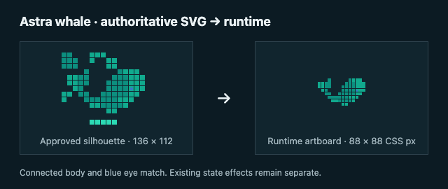

# Astra whale · bounded review corrections

Continues [Draft PR #25](https://github.com/hynk-studio/CodaBridge/pull/25) on `codex/astra-whale-indicator`, after fast-forwarding from `59563f5` to `c96970e0a81106a2273dcbe79ea35dc20e6a7253`. The PR body records the final head SHA. The [earlier implementation report](../astra-whale-verification/README.md) and its logs remain historical and unchanged.

## Authoritative reference

Verified and visually rendered **only** [astra-whale-approved-silhouette.svg](../astra-whale/astra-whale-approved-silhouette.svg) for this silhouette correction:

- Git blob: `48e86eab1c0d94890b6f5a45a94f8a1e4096ba41`
- SHA-256: `f250e3153ccddcf42e00ea9c93ebb50af06b9aa9b31ea91aaf62b152151c426f`
- Parsed SVG viewBox: `0 0 136 112`

The connected whale cells define the broader body, raised forked tail, gently stepped belly and short fin. Their positions, square dimensions and teal fills, plus the separate muted-blue square eye, are reproduced in the shared React body map. Detached reference effects are excluded from the body; the existing runtime square effects and animation remain unchanged.

The reference stays documentation-only. The runtime uses React/inline SVG, with no reference-image request or raster mascot. The superseded recovery PNG was not used for silhouette decisions in this correction. The corrupt `astra-whale-approved-original.png` removed upstream was not restored. No dependency was added.

## Action → evidence

Each ordered action retains its allowlisted human label and recorded attribution: **Requested by Astra** for `initiatedBy:"model"`, **Performed by CodaBridge** for `initiatedBy:"server"`.

“Inspect evidence: …” resolves `action.evidenceId` exactly against the same accepted current result. Enter or Space opens the existing deterministic evidence disclosure and focuses its summary. Repeated tool names remain distinguishable by evidence ID. Evidence is rendered once, as individually addressable disclosures; the A/B recording source attribution and citation anchors are preserved. Composer/Lab IDs are scoped to the rendered result instance.

Missing, unresolvable or ambiguous IDs have no navigation control and say “Evidence unavailable in this result.” No fallback target, external lookup or citation claim is invented. The new navigation reads no arguments, private creator text, draft bindings, provider payloads or hidden reasoning. It does not mutate the accepted result or application state; exports and structured result data are unchanged.

## Preserved lifecycle

| State | Unchanged presentation |
| --- | --- |
| Unavailable | Static subdued whale and existing unavailable copy |
| Ready | Static whale |
| Pending | “Astra request in progress…” and restrained local motion |
| Completed investigation | “Answer ready” |
| Completed edit | “Proposal ready — review before applying”; explicit Preview/Apply/Discard |
| Failed | Existing generic failure copy; no success state |
| Cancelled/invalidated | Motion stops; stale results remain rejected |

The 88 × 88 desktop and 72 × 72 narrow artboards, status placement, `aria-hidden`/non-focusable SVG, reduced motion, visibility pause and completion accent are unchanged. No live stages, internal thoughts, percentages, ETAs or artificial response delays were added. AbortController, generation and binding checks are unchanged in this review correction.

## Changed production files in this correction

- `src/astra/AstraActivity.tsx`: authoritative shared body and eye.
- `src/astra/actions.ts`: exact, unambiguous evidence resolution.
- `src/astra/AstraActions.tsx`: evidence controls with existing labels/attribution.
- `src/astra/AstraEvidence.tsx`: shared existing deterministic disclosure and scoped focus/navigation.
- `src/astra/astra.css`: wrapping evidence-control styling; motion/artboard rules unchanged.
- `src/InvestigationPanel.tsx`, `src/composer/Composer.tsx`, `src/lab/ContextLab.tsx`: reuse the shared disclosure beside accepted results.

## Verification · 2026-09-15

macOS; Node **v25.9.0**, npm **11.12.1**, Playwright **1.63.0**, Vite **8.3.0**. The production client was served by the local Wrangler preview. Existing TEST ONLY transports exercised the actual request handlers with the real credential excluded. Repeated fixture tool calls occur in separate permitted rounds.

| Exact command | Actual result |
| --- | --- |
| `env -u OPENAI_API_KEY npm run typecheck` | Passed ([log](typecheck.txt)) |
| `env -u OPENAI_API_KEY npm test` | **252 passed**, 0 failed/skipped ([log](unit-tests.txt)) |
| `env -u OPENAI_API_KEY npm run lint` | Passed ([log](lint.txt)) |
| `env -u OPENAI_API_KEY npm run build` | Client and Worker passed ([log](build.txt)); client 503.26 kB / 149.86 kB gzip retains the existing 500 kB warning |
| `env -u OPENAI_API_KEY npm run test:browser -- tests/browser/astra-whale.spec.ts --project=desktop-chromium --grep 'connected body\|action evidence' --max-failures=3` | **13 passed** after fixture corrections ([log](browser-focused.txt)) |
| `env -u OPENAI_API_KEY npm run test:browser -- tests/browser/astra-whale.spec.ts tests/browser/composer.spec.ts tests/browser/context.spec.ts tests/browser/investigation.spec.ts` | **160 passed**, desktop and phone ([log](browser-all.txt)) |
| `env -u OPENAI_API_KEY npm run test:browser -- tests/browser/astra-whale.spec.ts --grep 'action evidence is exact\|unavailable is static'` | **14 passed** after adding explicit Tab access and checking both documentation-reference names for unwanted network requests ([log](browser-keyboard-final.txt)) |
| `git diff --check` | Passed |

The first focused attempt stopped after three test/fixture failures: two checks tried to inspect Undo through a visible-only locator while the editor was hidden, and a fixture incorrectly returned two tool calls in one round. The locator now reads the existing hidden control state, and fixture calls use separate rounds. No production request handling was changed to accommodate them. That [initial log](browser-initial.txt) is retained separately.

Coverage includes exact authoritative SVG geometry/colors/eye; stable desktop/narrow sizes; every lifecycle state; reduced motion; explicit cancellation; automatic binding/question/workspace invalidation; late JSON delivered after abort; zero model tools; inert historical analysis; exact ordered model/server actions; distinct evidence for repeated names; missing/unresolvable/ambiguous evidence; keyboard Tab/Enter/Space and focused evidence; unchanged draft, selected block, workspace, Undo/Redo and accepted result; existing Preview/Apply/Discard and exports; private-field exclusion; and no extra requests from rendering or evidence inspection. The final action tests also Preview, Apply, Undo and Redo after opening evidence.

Independent in-app-browser inspection used screenshots and tab-level CDP Runtime/Network access. Desktop **1440 × 1000** and phone **390 × 844** showed 88/72 px artboards and no page overflow; inspected error logs were empty. The actual local status endpoint returned `unavailable / NOT_CONFIGURED`. The temporary browser tab, viewport override, local preview and keep-awake lease were cleaned up.

## Refreshed actual-UI evidence · TEST ONLY

- [Desktop pending](desktop-pending.png) · [completed](desktop-completed.png) · [actions](desktop-actions.png)
- [Phone pending](phone-pending.png) · [completed](phone-completed.png) · [actions](phone-actions.png)
- [320 CSS px with 200% root text](320-enlarged.png) · [wrapping evidence controls](320-actions.png); no horizontal page overflow
- [Desktop reduced pending](desktop-reduced-pending.png) · [reduced completed](desktop-reduced-completed.png)
- [Phone reduced pending](phone-reduced-pending.png) · [reduced completed](phone-reduced-completed.png)
- [Composer evidence focus](desktop-composer-evidence.png) · [A/B evidence focus](desktop-pair-evidence.png) · [phone Lab evidence](phone-lab-evidence.png) · [phone proposal evidence](phone-edit-evidence.png)
- [Reference → runtime comparison](reference-to-runtime.png): authoritative SVG alongside the actual rendered component SVG at its 88 px artboard; documentation only
- [Silent pending → completed clip](pending-to-completed-TEST-ONLY.mp4): refreshed real Playwright video, trimmed to **2.40 seconds**, H.264 **1440 × 1000**, no audio stream; pending/completed frames inspected. Controlled waiting is test-only.

## Preservation and limits

The diff against `c96970e` leaves request ownership/guards, server/provider code, prompts, contracts, access gates, exports, model configuration, data/research, Atlas/Prediction, crypto/Exchange, dependencies, build-warning threshold and hosting configuration unchanged. No code splitting or unrelated UI fixes were added. The earlier verification logs/assets and the unrelated pre-existing untracked image remain untouched.

The tests continue using the existing attributed DSWP `1.wav`, `2.wav`, `11.wav` and `7.wav` recordings at source revision `a2e5d6dd02fc60343e1288c33314e14e8b7aa5be`, CC BY 4.0, and the existing Context Lab segment `sw061b001_124-from-row-2-60s-v1`, CSV lines 2–24, from its pinned CC BY 4.0 archive. No source data, annotations or provenance changed; no research was regenerated.

No live Astra/model call, inference enablement, provider-contract change, hosting/Sites change, deployment, merge, force-push, new branch or new PR occurred. This is local automated and visual evidence, not live-provider, hosted, physical-phone, screen-reader or human-listening validation. PR #25 stays Draft for review.
