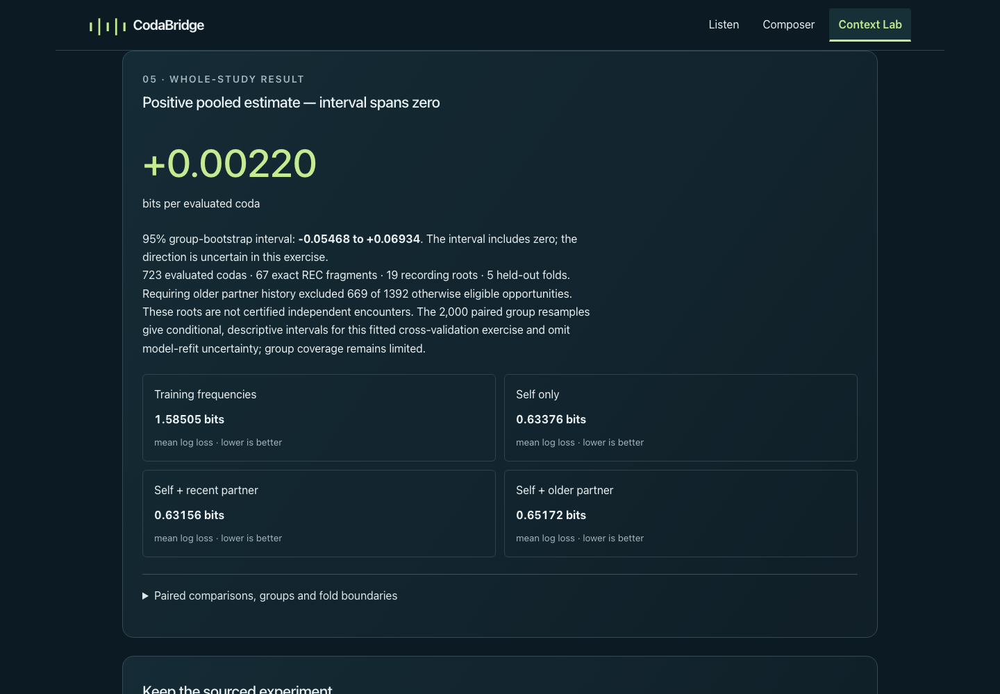

# MVP-05 review correction

Bounded correction to [Draft PR #11](https://github.com/hynk-studio/CodaBridge/pull/11), reviewed head `e446f96169ce7cde3e703861fb3b2e89a02109ee`, base `0adb2c1585e1fbda9ea52b8bbd1745e498ec0341`. Both matched the remote and local branch before work. The exact correction head/tree are recorded in the PR. No experiment redesign, retuning, fitting or result replacement occurred.

## Presentation

The whole-study headline is now **“Positive pooled estimate — interval spans zero.”** The observed estimate remains **+0.0022025623791761683 bits/coda** (displayed as +0.00220); its interval remains **[−0.05468203833214443, +0.06934150820669893]**. Neither zero effect nor a biological conclusion is inferred. The interval remains conditional and descriptive for this fitted cross-validation exercise, omitting model-refit uncertainty and not establishing encounter independence.

The presentation owner now receives the interval. It separately describes positive, negative and exact-zero estimates; intervals spanning/touching zero, entirely above/below zero, and missing uncertainty. A completed summary with `uncertainty: null` retains its estimate and explicitly says uncertainty is unavailable. Malformed intervals still fail schema validation. Failed and insufficient-data states continue to show no primary estimate. TEST ONLY unit/browser cases exercise these states without changing public result files.

## Enforced independent stationarity

`analysis/dialogue-transfer/stationarity.ts` extracts the existing scalar preprocessing, softmax and gradient reconstruction for independent tests. `verify.ts` now checks every coefficient and intercept gradient for finiteness and requires their maximum absolute component to be **≤ the frozen protocol `logistic.tol`, 1e-6**. It checks the report's embedded protocol against the frozen file, checks the objective is finite, and names the zero-based saved fold ID and model on failure. **No floating-point allowance is added to this acceptance bound.**

The objective is mean natural-log multinomial loss plus `sum(W²)/(2*C*n)`. Its coefficient gradient is `Xᵀ(p−y)/n + W/(C*n)`; its intercept gradient is `sum(p−y)/n`, without an intercept penalty. This matches pinned scikit-learn 1.7.2: [`_logistic.py`](https://github.com/scikit-learn/scikit-learn/blob/1.7.2/sklearn/linear_model/_logistic.py#L452-L470) sets the regularization scaling and passes `tol` as `gtol`; [`_linear_loss.py`](https://github.com/scikit-learn/scikit-learn/blob/1.7.2/sklearn/linear_model/_linear_loss.py#L316-L341) evaluates that mean loss and gradient. With no coefficient bounds, SciPy's projected gradient is the ordinary gradient. [SciPy 1.15.3 stopping criteria](https://docs.scipy.org/doc/scipy-1.15.3/reference/optimize.minimize-lbfgsb.html) also include objective reduction, so a successful optimizer status does not replace this explicitly enforced stationarity condition. Training's natural-log objective is distinct from the held-out base-2 reporting metric.

New read-only verification passes all **15 saved fold/model fits**. The maximum gradient remains **9.974999738824084e-7**, below 1e-6; scalar probability replay still differs by at most **9.992007221626409e-16**. This review finding was an unenforced diagnostic, not evidence that the historical fit failed. The recorded NumPy warning, backend diagnostic and original reproduction evidence are unchanged.

TEST ONLY diagnostics cover a hand-computable natural-log objective/regularization fixture, finite valid results, nonfinite and excessive coefficient/intercept gradients, and the exact acceptance boundary. Adding a common coefficient shift across all classes in an in-memory copy of a saved fit preserves softmax probabilities but violates penalized stationarity. No checked-in coefficients are mutated. A separate nonstationary synthetic fixture compares the scalar objective and every gradient component directly with the pinned estimator's `LinearModelLoss.loss_gradient`, including imputation/scaling, nonzero intercepts and C=2.5; it never calls `fit` or an optimizer. That short cross-implementation fixture uses 64 binary64 eps absolute comparison tolerance for evaluation ordering, separate from the unchanged stationarity bound.

## Newly executed checks

Environment: macOS arm64, Node 25.9.0, npm 11.12.1, isolated Python 3.12.14, pinned scikit-learn 1.7.2, Playwright 1.63.0. Provider credentials were excluded from every command below.

| Exact command from repository root | New result |
| --- | --- |
| `env -u OPENAI_API_KEY node --experimental-strip-types --test tests/prediction.test.ts tests/prediction-stationarity.test.ts` | 10/10 passed |
| `env -u OPENAI_API_KEY analysis/dialogue-transfer/.venv/bin/python -m unittest discover -s analysis/dialogue-transfer -p 'test_stationarity_reference.py' -v` | 1/1 pinned objective/gradient comparison passed; no fitting |
| `env -u OPENAI_API_KEY npm run analysis:verify` | Passed with all 15 stationarity conditions enforced; saved artifact/source/bootstrap checks passed |
| `env -u OPENAI_API_KEY npm run typecheck` | Passed |
| `env -u OPENAI_API_KEY npm test` | 191/191 passed |
| `env -u OPENAI_API_KEY npm run lint` | Passed |
| `env -u OPENAI_API_KEY npm run build` | Passed; final client and native Worker artifacts built |
| `env -u OPENAI_API_KEY npm run test:browser -- tests/browser/prediction.spec.ts` | Final **8/8 passed**, desktop/phone plus 320 px at 200% text |

The initial focused browser run passed six cases and caught two enlarged-text failures: the new unbroken “conditional/descriptive” text overflowed by 19 px. In-app Browser DOM measurements isolated that phrase (312 px content in a 266 px paragraph). Replacing the slash with “conditional, descriptive” fixed wrapping; the final build/browser run above passed without a CSS change. Final captures were visually inspected at 1440×1000, 390×844 and 320×844 with 200% text. In-app Browser accessibility inspection also observed the corrected headline after Reveal; temporary viewport/font overrides were restored and its tab closed. The local preview and 30-minute keep-awake lease were stopped.

The browser checks newly verify actual frozen-result wording and numbers, signed/zero/missing/failed/insufficient TEST ONLY states, Reveal/reset, no pre-Reveal target in DOM/accessibility/audio, Composer/codebook/Undo/Redo preservation, and actual sourced JSON delivery. Desktop and phone downloads both match the unchanged **2,128,588-byte** historical JSON, SHA-256 `0c9f61cb547fec66a57e302a393623066ff6d5fbf0e7d1975fc2c30734c5029d`. All three valid default model POSTs returned **503 / NOT_CONFIGURED**; the prediction page emitted no model POST or page error. [Desktop evidence](desktop-evidence.json), [phone evidence](phone-evidence.json), [unchanged historical browser-delivered JSON](../dialogue-transfer-v0.1/browser-delivered.json).

The previous actual experiment, fitting/reproduction tests, full browser run, `data:verify` and native-Worker test suite in [MVP-05](../MVP_05.md) are **historical evidence**, not newly repeated here. This correction did not refit, rerun the unchanged fitting/native-Worker suites, deploy, enable inference, inspect credentials or make paid model requests. Human listening, physical-device behavior and hosted acceptance remain unverified.

## Preserved bytes and current captures

[Byte-preservation manifest](preserved-artifacts.json): **125 existing files** compared directly with Git objects at the reviewed head, all byte-identical. It covers the saved protocol, features, validation/cohort, audit/splits, fitting implementation/configuration, fitted coefficients, report/bootstrap/provenance, public result artifacts, source/data files, historical prediction captures/download and prior live-trial evidence. Only the offline verifier within those existing analysis files changed. The unrelated pre-existing untracked PNG remains untouched.

[Phone result](phone-study.png) · [320 px / 200% result](phone-320-enlarged-study.png).
